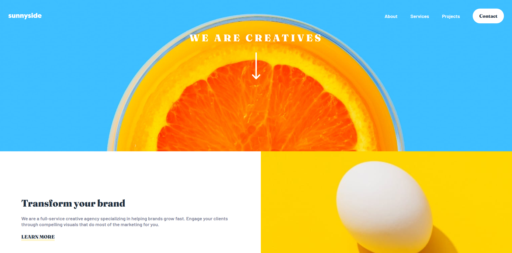

# Sunnyside Agency Landing Page

Landing page para una agencia creativa, desarrollada como solución al reto **[Sunnyside agency landing page](https://www.frontendmentor.io/challenges/agency-landing-page-7yVs3B6ef)** de [Frontend Mentor](https://www.frontendmentor.io/).

## 🖼️ Vista previa



## 📋 Descripción

El proyecto consiste en maquetar una landing page totalmente responsive a partir de un diseño proporcionado, incluyendo:

- Encabezado con navegación desktop/móvil y menú hamburguesa.
- Sección de características (transformación de marca, diseño gráfico, fotografía, etc).
- Sección de testimonios de clientes.
- Galería final de imágenes.
- Pie de página con enlaces y redes sociales.

## 🛠️ Tecnologías utilizadas

- **HTML5** semántico
- **CSS3** — Flexbox, CSS Grid, Media Queries, propiedades personalizadas (variables CSS)
- **JavaScript** puro — interacción del menú móvil

No se utilizan frameworks ni librerías externas; todo el maquetado está hecho con CSS puro.

## 📂 Estructura del proyecto

```
agency-landing-page/
├── assets/
│   ├── css/
│   │   └── styles.css
│   ├── images/
│   │   └── ...
│   └── js/
│       └── script.js
├── index.html
├── .gitignore
└── README.md
```

## 🚀 Cómo ver el proyecto

Accede al enlance de **[Pages](https://pedrobelmonte8.github.io/agency-landing-page/).**

## 🚀 Cómo verlo localmente

No requiere instalación ni dependencias. Basta con clonar el repositorio y abrir el archivo `index.html` en el navegador:

```bash
git clone https://github.com/pedrobelmonte8/agency-landing-page.git
cd agency-landing-page
```

Después, abre `index.html` directamente en tu navegador, o usa una extensión como **Live Server** (VS Code) para levantar un servidor local con recarga automática.

## 📱 Diseño responsive

El sitio está adaptado para verse correctamente en:

- 📱 Móvil
- 💻 Escritorio

utilizando media queries en CSS para reorganizar el diseño (grid de características, testimonios y navegación) según el ancho de pantalla.

## ✅ Objetivos del reto

- [x] Maquetado fiel al diseño en móvil y escritorio
- [x] Estados de `:hover` en enlaces y botones
- [x] Menú de navegación móvil funcional
- [x] Uso de Grid y Flexbox para el diseño

## 🔗 Enlaces

- Repositorio: [Github - Agency landing page](https://github.com/pedrobelmonte8/agency-landing-page)
- Reto original: [Frontend Mentor - Sunnyside agency landing page](https://www.frontendmentor.io/challenges/agency-landing-page-7yVs3B6ef)

## 👤 Autor

**Pedro Belmonte**
- GitHub: [@pedrobelmonte8](https://github.com/pedrobelmonte8)
